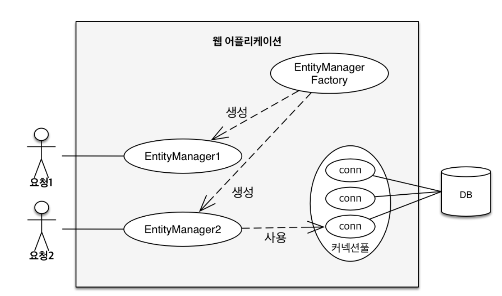
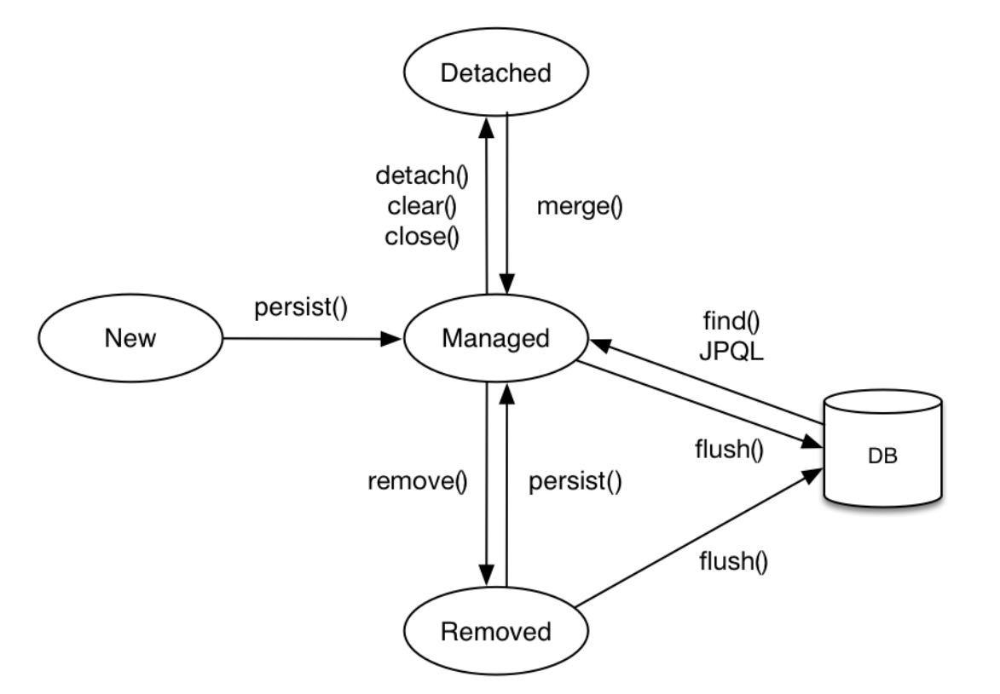
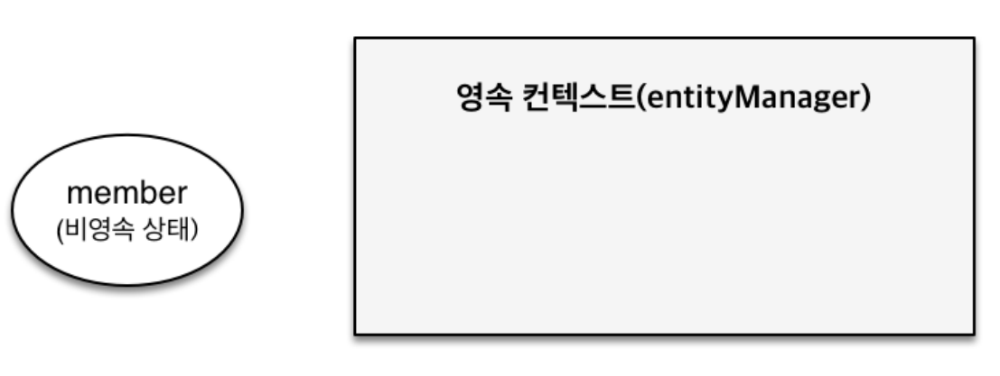
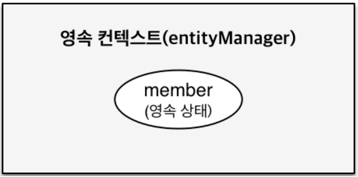
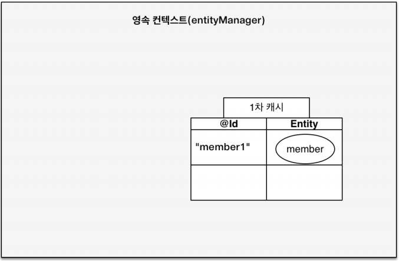
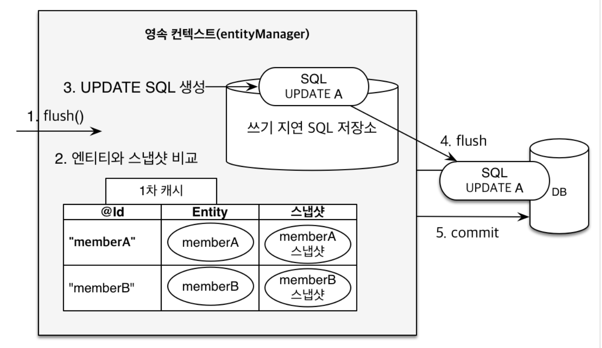

# 영속성 컨텍스트

### JPA에서 가장 중요한 2가지
    1. 객체와 관계형 데이터베이스 매핑하기(Object Relational Mapping)
    2. 영속성 컨텍스트

### 영속성 컨텍스트(Persistence Context)
  * Entity를 영구 저장하는 환경
  * EntityManager를 통해서 영속성 컨텍스트에 접근 가능
  
### EntityManager와 EntityManagerFactory


* __EntityManager__: Entity를 관리하는 클래스
* __EntityManagerFactory__: 웹 어플리케이션에 단 하나만 존재하며 요청마다 EntityManager를 생성해주는 역할을 한다.

### Entity의 생명주기


* __비영속(new/treansient)__: 영속성 컨텍스트와 전혀 관계가 없는 새로운 상태
      
    
* __영속(managed)__: 영속성 컨텍스트에 관리되는 상태
  
  

* __준영속(detached)__: 영속성 컨텍스트에 저장되었다가 분리된 상태
* __삭제(removed)__: 삭제된 상태
  
### 영속성 컨텍스트의 이점
* __1차 캐시__
    
    

  * 쿼리 수가 줄어들 수 있다. 비즈니스 로직이 복잡할 경우 이점을 본다.
  * 그러나 현업에선 성능적인 이점보다 컨셉이 주는 이점이 크다.
  * 1차 캐시를 통해 동일성을 보장한다.

* __트랜잭션을 지원하는 쓰기 지연__
  * 트랜잭션을 커밋하는 순간 데이터베이스에 INSERT SQL을 보낸다. 
```java
EntityManager em = emf.createEntityManager();
EntityTransaction transaction = em.getTransaction();
// 엔티티 매니저는 데이터 변경시 트랜잭션을 시작해야 함.
transaction.begin(); // 트랜잭션 시작

em.persist(memberA);
em.persist(memberB);
// 여기까지 INSERT SQL을 데이터베이스에 보내지 않는다.

// 커밋하는 순간 데이터베이스에 INSERT SQL을 보낸다.
transaction.commit();// 트랜잭션 커밋
```
* __변경 감지(dirty checking)__
  
  
  
  * 영속 엔티티 조회 후 해당 엔티티 데이터를 수정하기만 하면 변경 감지를 통해 별도의 코드 없이 JPA가 수정된 데이터를 자동으로 데이터베이스에 반영한다.
* __지연 로딩__: 객체가 실제 사용될 때 로딩


### 플러시
* __플러시(flush)__: 영속성 컨텍스트의 변경내용을 데이터베이스에 반영
  
* __플러시가 발생하는 경우__
  * 변경 감지
  * 수정된 Entity 쓰기 지연 SQL 저장소에 등록
  * 쓰기 지연 SQL 저장소의 쿼리를 데이터베이스에 전송(등록, 수정, 삭제 쿼리)
  
* __영속성 컨텍스트를 플러시하는 방법__
    * __em.flush()__ - 직접 호출
    * __트랜잭션 커밋__ - 플러시 자동 호출
    * __JPQL 쿼리 실행__ - 플러시 자동 호출
  
### 준영속 상태
* 영속 상태의 엔티티가 영속성 컨텍스트에서 분리
* 영속성 컨텍스트가 제공하는 기능을 사용 못함
  
* __준영속 상태로 만드는 방법__
  * em.detach(entity) - 특정 엔티티만 준영속 상태로 전환
  * em.clear() - 영속성 컨텍스트를 완전히 초기화
  * em.close() - 영속성 컨텍스트를 종료


